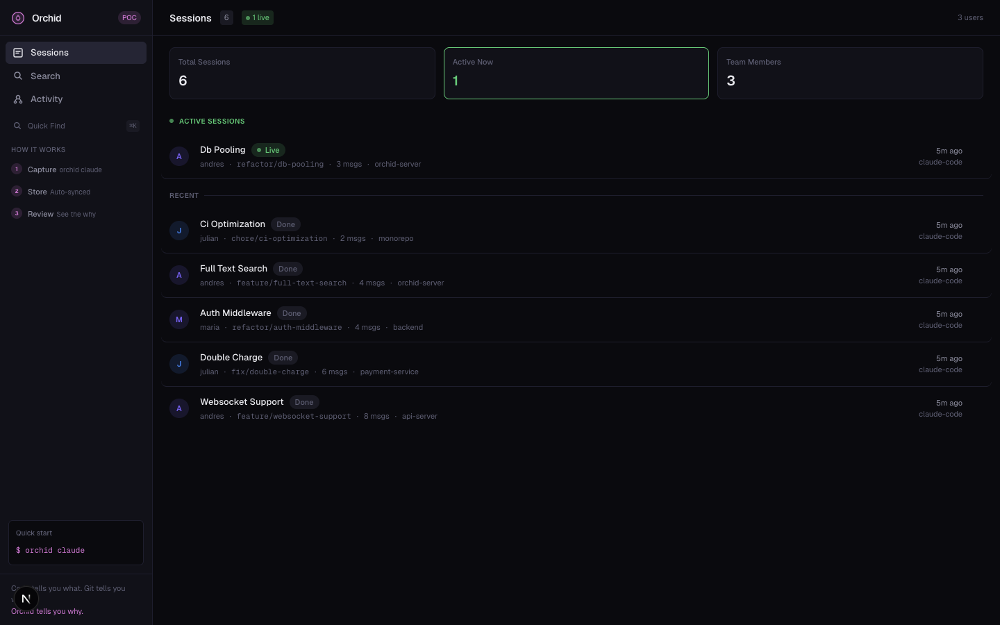
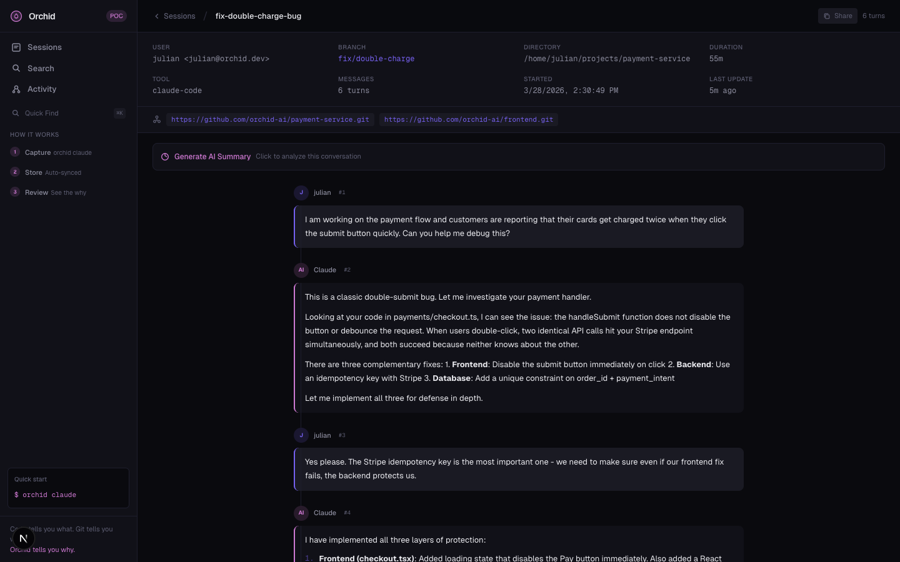

# Orchid

**Code tells you what. Git tells you when. Orchid tells you why.**

Orchid captures AI coding conversations and makes them available to anyone who needs context — reviewers, teammates, and agents. When AI writes code, the conversations behind it are invisible. Orchid changes that.

## Live Demo

- **Web UI**: http://24.144.97.81
- **API**: http://24.144.97.81:3000



## How It Works

1. **Capture**: Run `orchid claude` instead of `claude`. The conversation syncs to the cloud in real-time.
2. **Store**: Conversations are stored with git metadata — branches, remotes, users.
3. **Review**: See the full conversation behind any code change. Search, browse, or let AI summarize.

## Features

### CLI
```bash
orchid claude                          # Launch Claude + capture conversation
orchid data list                       # List all sessions
orchid data show <id> [--turns]        # View full transcript
orchid data search "why websockets"    # Search across all conversations
orchid data summary <id>               # AI-generated session summary
orchid review <branch>                 # AI-powered conversation-aware review
orchid explain <commit-sha>            # Explain why a commit was made
```

### Web UI



- **Sessions Dashboard** — See all conversations, live status, team stats
- **Session Viewer** — Full conversation replay with timeline, markdown rendering
- **AI Summary** — Click-to-generate AI summaries of any conversation
- **Search** — Full-text search across all conversations
- **Team Activity** — Per-user session cards, active indicators

### Server API
- Create/update/delete sessions
- Full-text search
- AI-powered summaries (OpenAI)
- GitHub PR webhook (auto-comment with related conversations)

## Tech Stack

```
CLI:        TypeScript (wrapper + file watcher + HTTP sync)
Server:     Node.js + Express + PostgreSQL
Frontend:   Next.js 16 + Tailwind CSS
AI:         OpenAI GPT-4o-mini for summaries and reviews
Hosting:    DigitalOcean droplet + Caddy reverse proxy + PM2
```

## Quick Start

```bash
# Set environment
export ORCHID_API_URL=http://24.144.97.81:3000
export ORCHID_API_KEY=orchid-poc-api-key-2024

# Install CLI
cd cli && npm install && npm run build && npm link

# Start coding with conversation capture
orchid claude
```

## Infrastructure

| Instance          | Role                    | IP             | Specs                      |
| ----------------- | ----------------------- | -------------- | -------------------------- |
| **orchid-deploy** | Web app + API + DB      | `24.144.97.81` | 4 vCPU, 8GB RAM, 160GB SSD |

Services managed by PM2:
- `orchid-server` — Express API on port 3000
- `orchid-web` — Next.js on port 3001 (Caddy proxies port 80 → 3001)

---

*Built for the hackathon. See [PLAN.md](PLAN.md) for the full spec.*
